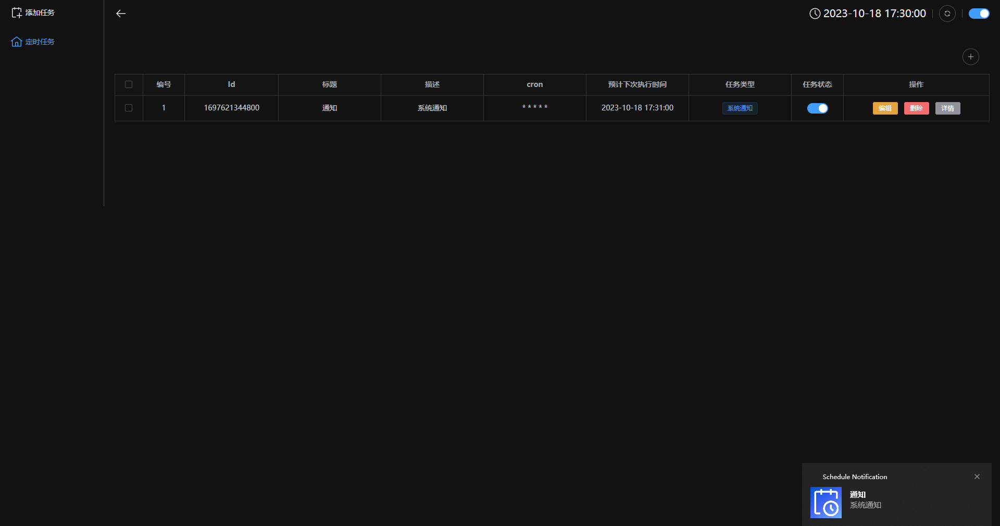
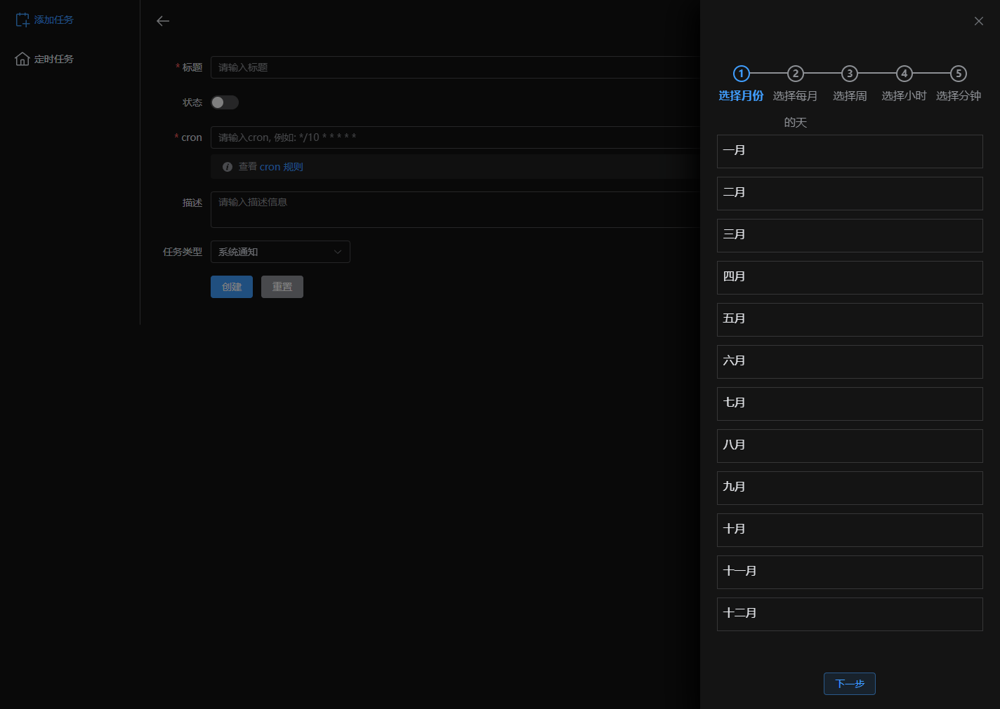

<div align="center">
  
</div>
<h3 align="center">Schedule</h3>

<div style="text-align: center;width: 100%;">
  <a href="./README.zh-CN.md">中文</a> | <span>English</span>
</div>

A Schedule Tools, You can create a scheduled task by using the cron string
> home



> create schedule



## Schedule directive
You can select part of the instructions, combine and sort, to achieve the effect you want. For example, by the combination of `date-time` and `notification` two directives, set to execute once an hour, then you get an instruction that will ring every hour.
If you are a fan of the Internet of Things (IOT) and have built-in MQTT messaging service, you only need to configure your own MQTT service to send MQTT content on a regular basis.
more directive see [ here ](./docs/directive.md)

## Usage
> need
* node >= 16.*
* typescript >= 5.1.3
* pnpm >= 8.6.0

### install
```shell
pnpm i
```
### run
```sh
pnpm dev
```
### build
```sh
pnpm build
```
