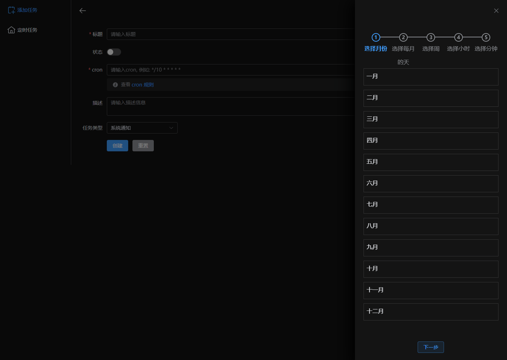

<div align="center">
  
</div>
<h3 align="center">Schedule</h3>
<div style="text-align:center">
  <span>中文</span> | <a href="./README.md">English</a>
</div>

计划工具，您可以使用cron字符串创建计划任务

> 首页


> 创建 `schedule` 页面



## Schedule 类型

> `通知`

在通知中显示输入的执行内容。当执行内容为空时将显示描述信息。

> `打开网站`

通过浏览器打开指定的网址。

> `脚本`

仍然处于测试阶段，您只能执行简单的JavaScript代码。

> `指令`

设置 `key` 关键字 执行内部内置指令。
**例如**
```yaml
key: date-time
args:
  format: YYYY-MM-dd HH:mm:ss
```

你能获得当前时间并通过系统展示

## 使用
> 环境要求
* node >= 16.*
* typescript >= 5.1.3
* pnpm >= 8.6.0

### 安装
```sh
pnpm i
```
### 运行
```sh
pnpm dev
```
### 构建

```sh
pnpm build
```

